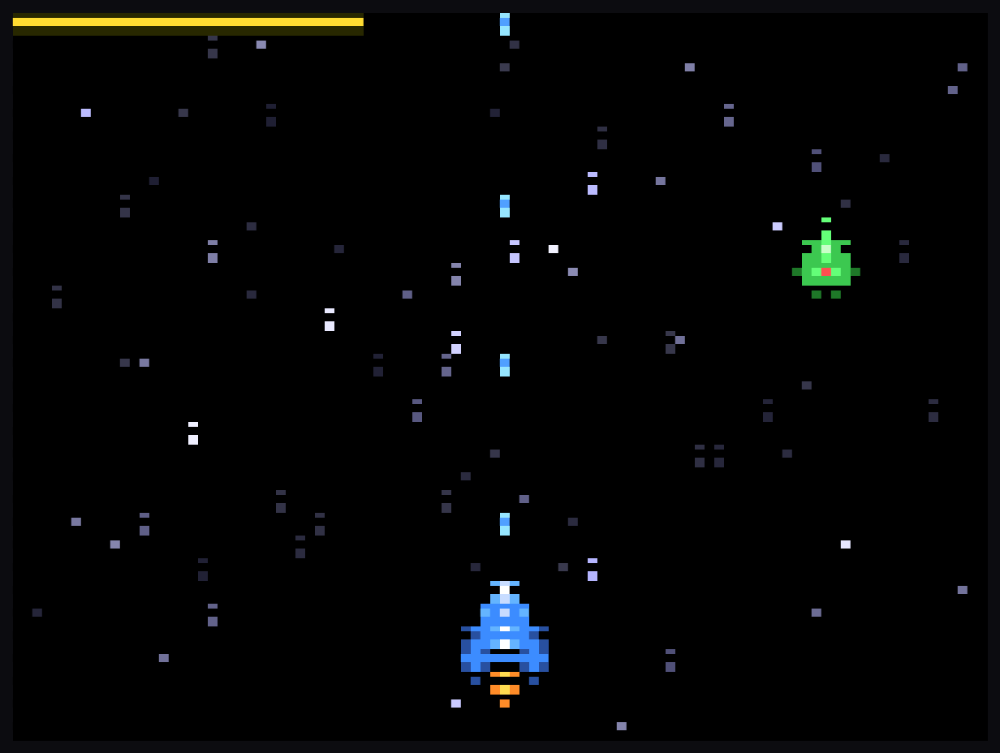

<div align="center">



# 🛸 Space Shooter

**Un shoot'em up espacial para la terminal, rápido, con framebuffer propio y audio real.**


</div>

---

## Qué es esto

Un matamarcianos clásico que corre íntegramente en la terminal, escrito 100% en Rust 🦀. Pilotas una nave a través de un campo de estrellas con parallax, esquivas y derribas oleadas de enemigos, y disparas mientras el juego se anima con fluidez gracias a un **framebuffer propio**. Incluye sprites en ASCII, balas del jugador y enemigas, audio real con efectos de sonido y un modo demo alternativo.

## 🎮 Cómo se juega

Pulsa **Espacio** en la pantalla de título para empezar. Mueve la nave en las cuatro direcciones, dispara y sobrevive el mayor tiempo posible acumulando puntuación.

| Tecla                 | Acción                             |
|-----------------------|------------------------------------|
| `←` `→` `↑` `↓` / `WASD` | Mover la nave                   |
| `Espacio`             | Disparar                           |
| `Espacio`             | Empezar (en la pantalla de título) |
| `R`                   | Reiniciar (tras game over)         |
| `Q` / `Esc`           | Salir                              |

## 🚀 Cómo ejecutar

Necesitas el toolchain de **Rust** (`cargo`).

```bash
# Compilar y ejecutar en modo release (recomendado)
cargo run --release

# Modo demo alternativo
cargo run --release -- --rayman
```

## 📸 Captura

<div align="center">

</div>

## 🛠️ Bajo el capó

- **Rust** (edición 2021), con bucle de juego a ~30 FPS y **framebuffer** propio para una animación fluida.
- [`crossterm`](https://crates.io/crates/crossterm) — control de terminal y entrada de teclado.
- [`rodio`](https://crates.io/crates/rodio) — audio real (efectos de sonido y música).
- [`rand`](https://crates.io/crates/rand) — aleatoriedad de oleadas y enemigos.
- Módulos: `framebuffer`, `starfield`, `enemies`, `bullets`, `player`, `sprites`, `audio` y `game`.

## 📦 Créditos

Hecho con cariño por [@gavilanbe](https://github.com/gavilanbe). Uno más de mi colección de pequeños juegos de terminal en Rust. 🕹️

## 📄 Licencia

[MIT](LICENSE)
